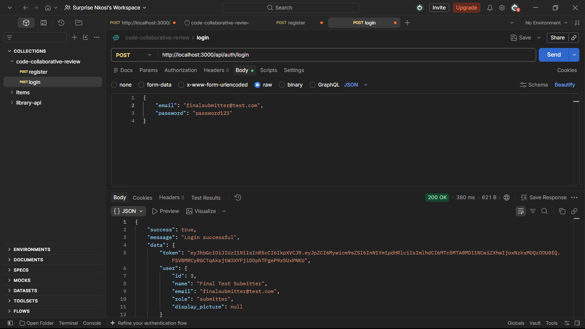
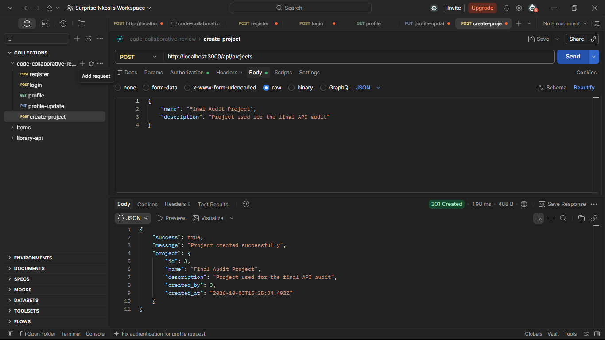
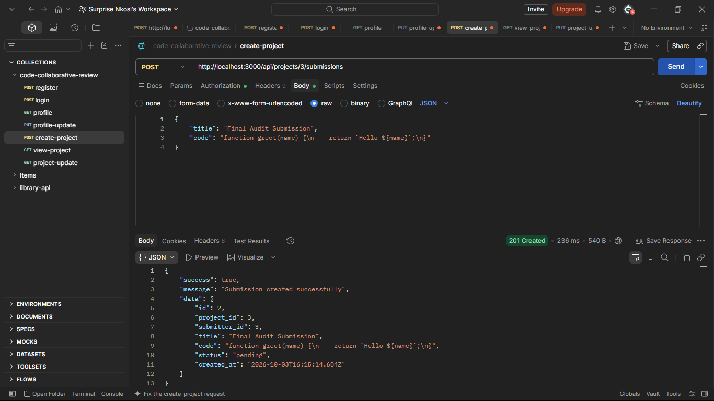
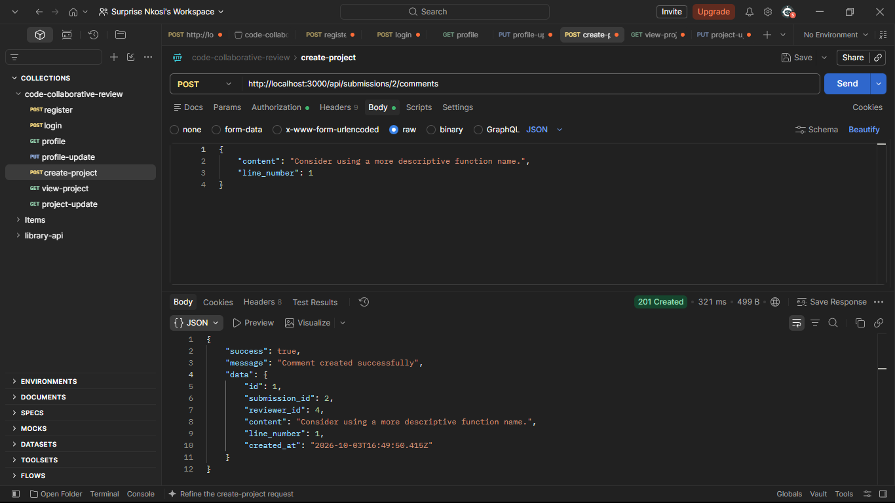
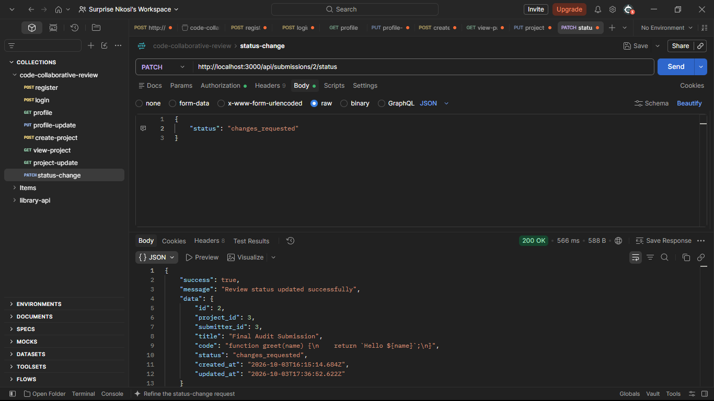
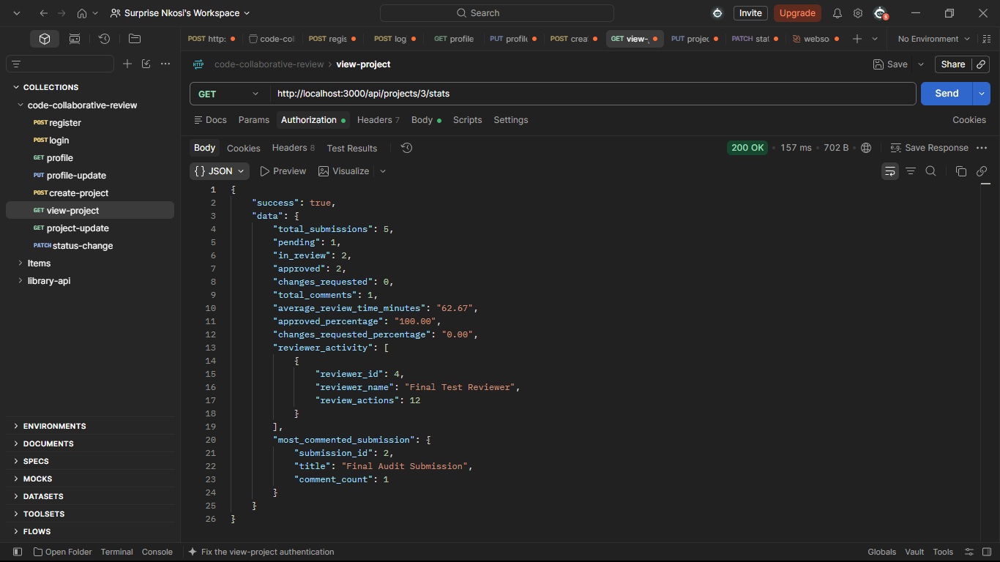
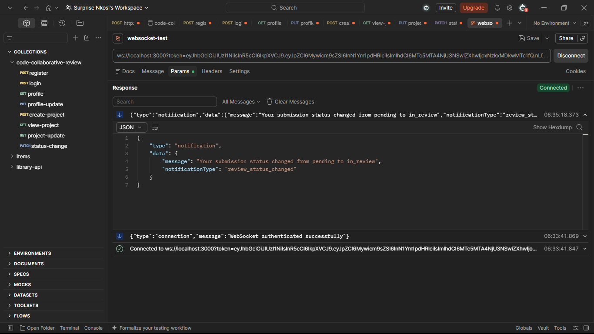

# Code Collaborative Review

An API-driven collaborative code review platform built with **Node.js, TypeScript, Express, PostgreSQL, JWT, and WebSockets**.

The platform allows development teams to submit code for review, provide inline or general feedback, manage review workflows, receive notifications, and monitor project-level review statistics.

---

## Features

- JWT authentication and role-based authorization
- Submitter and Reviewer roles
- User profile management
- Project creation and member management
- Code submissions and status tracking
- General and inline code comments
- Review approval and change requests
- Review history tracking
- User activity notifications
- Real-time WebSocket updates
- Project review analytics
- Request validation and error handling

---

## Tech Stack

- Node.js
- TypeScript
- Express
- PostgreSQL
- JSON Web Tokens (JWT)
- bcrypt
- WebSockets (`ws`)

---

## Project Structure

```text
code-collaborative-review/
    database/
        schema.sql

        src/
            config/
            controllers/
            middleware/
            routes/
            utils/
            websocket/
            app.ts
            server.ts

        .gitignore
        package.json
        package-lock.json
        tsconfig.json
        README.md
```

---

## Installation

Clone the repository:

```bash
git clone https://github.com/surprise2024-cpu/code-collaborative-review.git
```

Enter the project:

```bash
cd code-collaborative-review
```

Install dependencies:

```bash
npm install
```

---

## Environment Variables

Create a `.env` file in the project root.

```env
PORT=3000

DB_HOST=localhost
DB_PORT=5432
DB_USER=your_postgres_user
DB_PASSWORD=your_postgres_password
DB_NAME=your_database_name

JWT_SECRET=your_jwt_secret
```

> Do not commit the `.env` file to GitHub.

---

## Database Setup

Create a PostgreSQL database and run:

```text
database/schema.sql
```

This creates the tables required by the application, including users, projects, project members, submissions, comments, review history, and notifications.

---

## Running the API

Start the development server:

```bash
npm run dev
```

Type-check the project:

```bash
npm run typecheck
```

Build the project:

```bash
npm run build
```

The API runs by default at:

```text
http://localhost:3000
```

Health check:

```http
GET /api/health
```

---

## API Endpoints

### Authentication

```http
POST /api/auth/register
POST /api/auth/login
```

### User Profiles

```http
GET    /api/users/:id
PUT    /api/users/:id
DELETE /api/users/:id
```

### Projects

```http
POST   /api/projects
GET    /api/projects
GET    /api/projects/:id
PUT    /api/projects/:id
DELETE /api/projects/:id

POST   /api/projects/:id/members
GET    /api/projects/:id/members
DELETE /api/projects/:id/members/:userId
```

### Code Submissions

```http
POST   /api/submissions
GET    /api/projects/:id/submissions
GET    /api/submissions/:id
PATCH  /api/submissions/:id/status
DELETE /api/submissions/:id
```

The application also supports updating the title and code of a submission:

```http
PUT /api/submissions/:id
```

### Comments

```http
POST   /api/submissions/:id/comments
GET    /api/submissions/:id/comments
PUT    /api/comments/:id
DELETE /api/comments/:id
```

Comments may be general comments or associated with a specific line of code using `line_number`.

Only users with the **Reviewer** role can create, update, or delete comments.

### Review Workflow

```http
POST /api/submissions/:id/approve
POST /api/submissions/:id/request-changes
GET  /api/submissions/:id/reviews
```

Submission statuses include:

```text
pending
in_review
approved
changes_requested
```

### Notifications

```http
GET /api/users/:id/notifications
```

### Project Statistics

```http
GET /api/projects/:id/stats
```

Project statistics include:

- Total submissions
- Submission counts by status
- Total comments
- Average review time
- Approved percentage
- Changes-requested percentage
- Reviewer activity
- Most-commented submission

---

## Real-Time Updates

The application uses WebSockets to send live updates to authenticated users.

Connect using:

```text
ws://localhost:3000?token=YOUR_JWT_TOKEN
```

A valid JWT must be supplied through the `token` query parameter.

---

## Testing with Postman

The API can be tested using Postman.

Add the JWT returned by the login endpoint to protected requests:

```text
Authorization: Bearer YOUR_JWT_TOKEN
```

### Suggested Test Flow

```text
1. Register Submitter and Reviewer accounts
2. Login and obtain JWT tokens
3. Create a project as the Submitter
4. Add the Reviewer to the project
5. Create a code submission
6. Add general or inline comments as the Reviewer
7. Move the submission into review
8. Approve it or request changes
9. View the review history
10. Check notifications and project statistics
11. Connect a WebSocket client and test live updates
```

---

## Screenshots

### 1. Authentication

```text
Login
```



---

### 2. Project Creation

```text
Project-creation.png
```



---

### 3. Code Submission

```text
Code Submission
```



---

### 4. Inline Comment

```text
Comment
```



---

### 5. Review Workflow

```text
Status change
```



---

### 6. Project Analytics

```text
Project Stats.png
```



---

### 7. WebSocket Live Update

```text
Websocket Live Update
```



---

## Security

The API includes:

- Password hashing with bcrypt
- JWT authentication
- Role-based authorization
- Project ownership and membership checks
- Comment ownership checks
- Protected profile access
- Environment variables for sensitive configuration

Passwords are never returned by API responses.

---

## Author

**Suprise Nkosi**